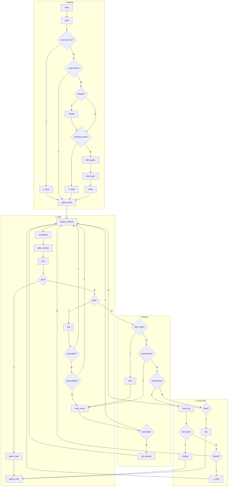

Hooks are functions to call after some events happens. Defined with `cr.hook()` function.

Usage:
```lua
cr.hook("<event>", function(args...)

    -- some action

end)
```

## Events

The game logic can be shown with this simple tree:

1. game starts and parses cli arguments, main menu starts and loads plugins
2. run hook: **`start`**
3. if a save file given with from cli arguments: 
    1. load save, run hook: **`s_load`**
    2. jump to 8
4. if --skip-menu flag given:
    1. jump to 8
5. if plugins reloaded, run hook: **`reload`**
6. if a save loaded from "Continue" menu:
    1. load save, run hook: **`s_load`**
    2. jump to 8
7. player creates a new game
    1. levels generetad, run hook: **`level_gen`** .
    2. cards generated, run hook: **`draw`**
8. game starts: **`game_start`**
9. game loop starts:
    * run hook: **`before_refresh`**
    * refresh ui completely
    * run hook: **`after_refresh`**
    * get a key, run hook **`key`**
    * if user quits from game, run hook: **`game_quit`**. exit from loop
    * if player picks a slot
        1. run hook **`slot`**. if hook cancels with return value, get back to loop
        2. if item added to inventory, get back to loop.
        3. else card event is runned. run hook: **`card_event`**. if not canceled, run hook **`hp_change`**
    * if player uses a item from inventory
        1. run hook: **`item`**
        3. else card event is runned. run hook: **`card_event`**. if not canceled, run hook **`hp_change`**
    * if any of the two things above happens, card events are runned depending on card ttl values and slot _lived fields. if card event is runned, run hook: **`card_event`**. if not canceled run hook: **`hp_change`**
    * if level completed
        1. run hook: **`level_up`**
        2. if all levels are completed, run hook: **`ending`**. exit from loop
        3. if player saves progress, run hook **`s_save`**
    * if player died, run hook: **`die`** and exit from loop
10. game ends, run hook: **`game_end`**

Or with this visualized graph:


### No return and no argument events

These events does not take any argument and does not return a value.

- `start`: Runned before everything and main menu.
- `reload`: Runned when plugins are reloaded.
- `draw`: Runned after `cr.draw_cards()`.
- `level_gen`: Runned after `cr.generate_levels()`
- `after_refresh`: Always runned after UI refresh.
- `before_refresh`: Always runned before UI refresh.
- `game_start`: When a new game starts.
- `game_end`: When a game ends.
- game_quit: When user quits from game.
- `die`: Runned when player dies.
- `ending`: Runned when player finds Amulet of Yendor.

### Has a return type or argument

These events takes arguments in varius types and may return a bool value.

##### **`key`**

Runned when a key pressed on main game loop.

No return type.
Takes an integer argument: the key pressed.

Handle the key with `string.char()` and `string.byte()` functions, and [`cr.curses.KEY_` variables](./Ncurses.md). 

##### **`hp_change`**

Runned after a card event runned and before changing HP (with card event return value and extra damage).
Takes a table argument contains these fields:
| Field         | Type      | Description |
| :--           | :-:       | :-- |
| `id`          | string    | ID of the card |
| `raw_base`    | integer   | Original Base HP change (card event return value) |
| `raw_extra`   | integer   | Original Extra damage |
| `base`        | integer   | Modifiable Base HP change |
| `extra`       | integer   | Modifiable Extra damage   |

`base` is a *HP change*, not damage. Positive = heal, negative = damage.
Shield/damage-reduction hooks should check `base < 0`.
You can modify `base` and `extra` fields.

An example hook for a shield:
```lua
cr.hook("hp_change", function(t)
    -- absorb half of the damage
    if t.base < 0 then
        t.base = math.ceil(t.base / 2)
    end

    if t.extra ~= 0 then
        t.extra = math.ceil(t.extra / 2)
    end
end)
```

> [!NOTE]
> Any field can be 0. `base == 0` means no HP change, `extra == 0` means no bonus damage.
> Always check signs: heals are `base > 0`, damage is `base < 0`.

> [!IMPORTANT]
> buff events are not effected, buffs directly changes HP via cr.player.set_hp()

##### **`level_up`**

Runned when exit gate found.

No return type.
Takes an integer argument: current level index.

##### **`slot`**

Runned when a slot picked.

Has bool return type: if true, slot will be skipped for now.
Takes an integer argument: slots number (1, 2, 3)

##### **`item`**

Runned when user wants to use an item.

Has bool return type: if true, using item is canceled.
Takes an shared card argument: the item used.

##### **`card_event`**

Runned when `cr.basic_card_event` called.

Has bool return type: if true, card event is canceled.
Takes following arguments:
  * Shared card : the card
  * integer : extra damage value

##### **`s_load` & `s_save`**

Runned after a save loaded (`s_load`) or created/updated (`s_save`).

No return type.
Takes 1 string argument: save data as json.

Example save data:
```json
{
    "_filepath": "/home/melon/.local/share/crogue/saves/7992049797823664169_1786440919.json",
    "created_with_plugins": {
        "test": "local",
        "vanilla": "https://codeberg.org/HasanAgitUnal/CROGUE-Vanilla.git"
    },
    "hp": 100,
    "inventory": [
        "vanilla:teleporter",
        "vanilla:apple",
        null,
        "vanilla:apple",
        "vanilla:apple",
        null,
        null,
        null,
        null,
        null
    ],
    "buffs": {
        "vanilla:absorption": 2,
        "vanilla:golem_pet": 5
    },
    "last_played": 1786440919,
    "level": 1,
    "name": "No name",
    "plugins_changed": false,
    "seed": 7992049797823664169
}
```


## Examples

```lua
-- show a log
cr.hook("start", function()
    cr.log("This log is added before everything")
end)

-- handle keyboard
cr.hook("key", function(key)
    if key == 27 then
        cr.log("pressed ESC")
    elseif key == cr.curses.BACKSPACE then
        cr.log("pressed backspace")
    elseif key == string.byte("a") then
        cr.log("pressed a")
    end
end)

-- disable cr.stat.slot1
cr.hook("slot", function(slot_id)
    if slot_id == 3 then
        return true
    end

    return false
end)
```


